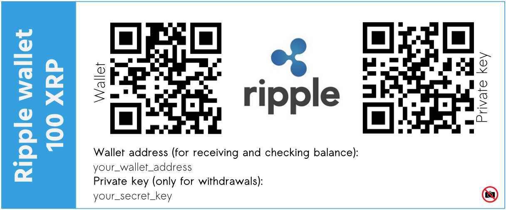

# Paper Wallet Printer

This is a simple tool for printing cryptocurrency paper wallets to be used in combination with any paper wallet generator. Follow links in the bottom if you need more information.



## Virtualenv and requirements
```bash
$ virtualenv -p python3 env
$ source env/bin/activate
(env) $ pip install -r requirements.txt
```

## Usage
```bash
(env) $ python pwp.py --amount=100 \
--address=your_wallet_address \
--secret_key=your_secret_key \
--template=designs/ripple-front-blue.svg
```

## Building one-file executable
It is strongly recommended the usage of the script in an offline computer. In order to do that you will need to create one-file python executable.
```bash
(env) $ pyinstaller --onefile pwp.py
```

Then you are ready to execute the script from an offline computer, for example by runnig a live usb linux distro.

## Paper wallets designs
Currenty, only Ripple design is available. You are welcome to create your own and open a pull request.I will be glad to accept it.

## Helpful links
* [Ripple/XRP offline paper wallet - and how to transfer Ripples with it!](https://steemit.com/cryptocurrency/@innersmile/xrp-offline-wallet-and-how-to-transfer-ripples-with-it)
* [Minimalistic Ripple Client project in Github](https://github.com/jatchili/minimalist-ripple-client)
